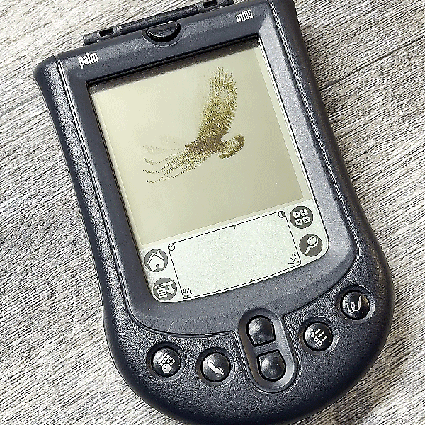

# Palm Pilot Animator



A native, full-screen, black-and-white animation player for Palm OS, developed with the Palm m105 and m125. The device app is branded Ade’s App. The launcher displays “Ade’s App”; the list heading is “Made by Ade”. The launcher icon uses the approved 32-pixel ADE stamp.

The repository includes **Golden Eagle** as its only demo. When you add more animations, six titles fit on each page; tap Prev/Next or use the physical scroll buttons to change pages.

Tap a title for full-screen playback. Tap anywhere in the image to pause or resume. Either physical scroll button returns to the list; Home returns to Applications. The Invert checkbox swaps black and white during playback and remembers the setting between launches.

## Current library

The included demo GIF is 160 × 160 and contains only black and white. The packer composites partial GIF frames and disposal, then preserves every displayed pixel without resizing or dithering. Titles come from filenames with the extension and trailing “-160px” removed, allowing spaces around the suffix.

The demo contains 19 frames at 100 ms each (1.9 seconds). The demo app occupies 63,902 bytes. Frames are accessed individually; inversion needs only one 3,216-byte scratch bitmap. The list supports up to 255 clips over multiple pages.

## Local web interface

A local browser interface lets you add GIFs, preview the actual Palm pixels, name animations, change framing/dithering/timing, estimate storage, and sync the collection. Files are processed on your own computer. No AI, cloud account, or WebUSB browser support is required.

After installing the prerequisites and running `sh tools/setup-local.sh`:

```sh
python3 -m venv .venv
. .venv/bin/activate
python3 -m pip install -r requirements.txt
sh tools/run-web.sh
```

Open **http://localhost:8765**. The launcher automatically uses `.venv/bin/python3`; set `PALM_PYTHON` to use a different Python with Pillow. Leave the terminal running while using the interface.

1. Load Golden Eagle or add your own GIFs (up to 20 MB each).
2. Select an animation to preview or edit it. Automatic preserves opaque 160 × 160 black-and-white GIF pixels exactly. Other GIFs are center-cropped and dithered by default; Fit whole image adds white margins. Fixed frame rates change playback speed without dropping frames.
3. Choose m105/PalmConnect or m125/native USB. Return the Palm to Applications and click **Sync to Palm**.
4. Wait for the interface to ask you to press the physical HotSync button. The receiver saves a fresh backup, checks free memory, sends the app, and verifies every resource by reading it back.

**Build & download** produces a PRC without contacting a device. Preview inversion affects only the browser; the Palm has its own Invert checkbox. The interface remembers your local collection between server restarts. Every sync replaces the full app; separate animation databases are not implemented yet.

Uploaded originals, prepared frames, and builds are stored under `.local/web/`. Device backups are stored under `backups/web-*`. Both locations are excluded from Git. Removed or superseded animation files remain in local storage for recovery. Only the shipped Golden Eagle demo is tracked.

The UI uses a conservative 6 MB library budget and a maximum of 1,800 frames. A device with less free memory can reject a smaller collection. Sync is serialized; cancellation is available while preparing or waiting, and is disabled after the Palm connects. Keep the server running and the Palm connected until verification completes.

The server binds only to `127.0.0.1`; it checks Host headers and requires a per-run token on changes. It is a local utility, not a public upload server. Fonts may load from Google Fonts, with local serif/sans fallbacks if offline.

See [web implementation and checks](docs/WEB.md).

## Local project layout

- app/: native C player and menu
- assets/source/: included Golden Eagle demo GIF; other user GIFs are excluded from Git
- assets/generated/: native bitmap resources, timings, and library metadata
- tools/: conversion, build, connection, installation, local web server, and validation tools
- web/: browser interface styled with Ade’s Design System
- build/: generated PRC application, excluded from Git
- backups/: device backups and verified previous builds, excluded from Git
- .local/: downloaded compiler, SDK, and HotSync library, excluded from Git

Generated resources are included in Git so rebuilding the current application needs no GIF processing dependencies.

## Build and convert

No AI service, API key, or assistant is required. Conversion, compilation, backup, installation, and verification are performed by the scripts in this repository. The current workflow targets Apple Silicon macOS; Windows and Linux setup is not provided.

Install these prerequisites yourself before running setup:

- Node.js 24 with npm (tested with Node 24.16.0).
- Python 3 (tested with Python 3.14.7).
- libusb, discoverable as `usb-1.0`; the bridge also checks `/opt/homebrew/lib/libusb-1.0.dylib`.
- Rosetta 2 for the historical x86_64 Palm compiler.
- Git, curl, tar, and shasum, used by the dependency setup script.

Setup needs internet access to download the pinned compiler, SDK, and HotSync library and install npm dependencies. The supplied generated resources allow compiling the demo without Pillow.

```sh
sh tools/setup-local.sh
sh tools/build-local.sh
```

The result is `build/PalmAnimation.prc`. To replace the library, put 160 × 160 black-and-white GIFs in `assets/source/`, then use Python with Pillow. The packer replaces the entire library with the GIFs in that folder; remove the demo GIF if you do not want it included:

```sh
python3 -m venv .venv
. .venv/bin/activate
python3 -m pip install -r requirements.txt
```

Convert, build, and check:

```sh
# This performs exact pixel packing.
python3 tools/pack-library.py assets/source assets/generated
sh tools/build-local.sh
python3 tools/test-library.py "$PWD"
python3 tools/test-transport.py
```

The setup helper restores pinned compiler, SDK, and HotSync dependencies under `.local/`. Pillow is needed when packing or validating GIFs and running the conversion tests. Golden Eagle is included so source-comparison tests work for the demo; other GIFs are excluded from Git. Run `python3 tools/test-conversion.py` for conversion checks using synthetic images.

`tools/convert-gif.py` remains available for other GIFs that require resizing or new dithering; it is not used for the current clips.

## Connection and installation

The PalmConnect USB adapter (0830:0080) does not expose a serial port on this Mac. The local bridge uses libusb and the KLSI adapter protocol to carry Palm SLP/PADP/CMP/DLP traffic. It validates SLP checksums and packet CRCs and recovers from incomplete startup traffic.

```sh
# Read device information and save a RAM database backup.
sh tools/run-hotsync.sh backup

# First install on a device with no PAnm app: use the completed backup directory.
PALM_BAUD=115200 sh tools/run-hotsync.sh install backups/YOUR_BACKUP

# Update: point to a saved PRC that exactly matches the currently installed app.
PALM_BAUD=115200 PALM_REPLACE_FROM="$PWD/backups/previous-build.prc" \
  sh tools/run-hotsync.sh install backups/YOUR_BACKUP
```

Close the animation app and return to Applications before installing an update. Press HotSync after the helper prints READY. Connections start at 9600 baud. PALM_BAUD controls the requested maximum; omitting it uses 9600. The library negotiates with the Palm, then the bridge applies the agreed adapter setting before device reads or installation. Installation requires a completed backup, rejects app identity collisions, verifies any app being replaced against a saved previous build, saves that installed app locally, and reads all new resources back for comparison. When renaming the app, it removes the previous database only after the new app passes verification.

For future updates, save the current verified PRC before rebuilding and use it as PALM_REPLACE_FROM.

## Native USB on Palm m125

An earlier build installed and passed resource verification on an m125 running Palm OS 4.0.1. Its native USB connection is substantially faster than the m105 adapter. The native receiver supports only USB 0830:0040 and backs up RAM databases before installing.

```sh
PALM_SYNC_ROOT="$PWD/.local/palm-sync" PALM_INSTALL="$PWD/build/PalmAnimation.prc" \
  node tools/hotsync-usb.cjs backups/m125-new-session
```

Press HotSync on the m125 after the receiver is ready. For an update, set PALM_REPLACE_FROM to the verified previous PRC as with the adapter-based installer.

## Verification and dependencies

See [hardware and build status](docs/STATUS.md) for the distinction between checked build data and confirmed device behavior, plus dependency provenance. Compiler, SDK, USB dependencies, device backups, and build outputs are not bundled in the repository. Generated animation pixels and the launcher artwork are included. No project license has been selected yet; dependencies retain their upstream licenses.
